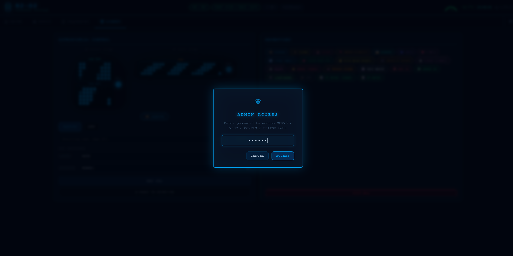
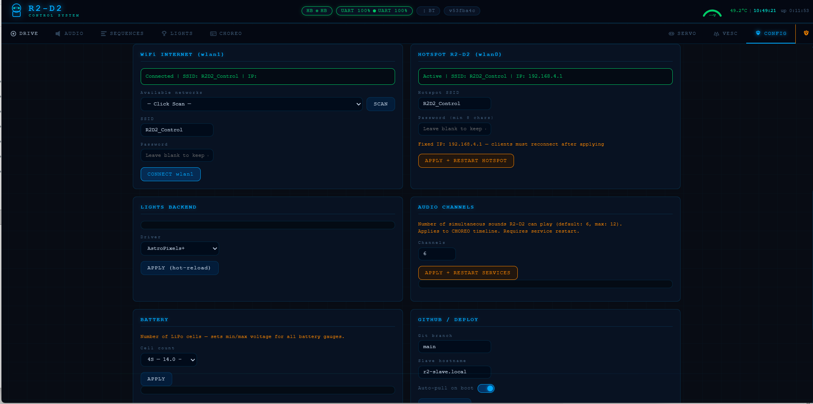

<div align="center">

# 🤖 AstromechOS

**The open control platform for astromech builders.**

[](LICENSE)
[](https://python.org)
[](https://www.raspberrypi.com/)
[](android/compiled/)
[](slave/sounds/)
[](master/sequences/)
[](master/api/)

*Two Raspberry Pi 4B · UART through slip ring · Full web dashboard · Android app · Bluetooth gamepad · 317 authentic sounds · 40 expressive sequences · Choreography timeline editor*

</div>

---

## Why this and nothing else?

Most R2-D2 builders end up with a pile of shell scripts, a half-working web interface, and a robot that does one thing at a time. **This isn't that.**

This system was built from the ground up to make R2-D2 feel **alive** — not just remote-controlled. A single button press triggers coordinated sound + dome rotation + panel choreography + light sequence simultaneously. The safety system has three independent watchdog layers so the robot *cannot* run away. Kids Lock limits speed for young pilots. Child Lock blocks all motion when R2 is on display. Everything deploys itself from a single button press on the dome.

If you're building a full-scale R2-D2 and you want a control system actually worthy of the build — **this is it**.

---

## What is this?

A **complete, production-grade control system** for a 1:1 scale R2-D2 replica. Two Raspberry Pi 4B communicate over a **physical UART through the dome slip ring**, with layered safety watchdogs, a REST API, an Android app, Bluetooth gamepad support, and 40 expressive behavioral sequences that give R2-D2 a real personality.

- **Master Pi 4B 4GB** (dome, rotates) — Flask REST API, web dashboard, dome servos & panels, LED logics, visual editors, BT gamepad. 4GB headroom for future local AI (face detection, voice recognition — all on-device, no cloud)
- **Slave Pi 4B 2GB** (body, fixed) — Drive motors (dual VESC), body servo panels, dome rotation motor, 317-sound audio system, RP2040 diagnostic LCD. Kept deliberately lightweight — only real-time I/O, no AI workloads
- If the UART link drops for more than 500ms, drive motors **cut immediately** — no runaway robot, ever

---

## Screenshots

<table>
<tr>
<td align="center" width="50%">

### 🕹️ Drive
Dual joystick · WASD + arrow keys · MJPEG camera feed · Speed arc + direction HUD · E-Stop · Lock modes


</td>
<td align="center" width="50%">

### 🔊 Audio
317 sounds · 14 mood categories · Animated waveform · Perceptual volume curve · Drag-and-drop upload (admin)


</td>
</tr>
<tr>
<td align="center" width="50%">

### 🟡 Kids Lock
Speed capped at configurable % — great for shows with young pilots


</td>
<td align="center" width="50%">

### 🔴 Child Lock
All motion blocked — R2 on display safely, lights & sounds still work


</td>
</tr>
<tr>
<td align="center" width="50%">

### 🎬 Sequences
40 behavioral sequences · Pill categories · Emoji picker · Loop mode · Admin drag-to-reorder


</td>
<td align="center" width="50%">

### 💡 Lights
Teeces32 or AstroPixels+ · 22 animations · FLD/RLD/BOTH text · PSI sequences


</td>
</tr>
<tr>
<td align="center" width="50%">

### 🎼 Choreography Timeline Editor
Multi-track · Drag-and-drop · VESC drive · audio · servos · lights in sync · Digital Twin monitor


</td>
<td align="center" width="50%">

### 🔐 Admin Login
Password-protected · Unlocks upload, category creation, sequence editor



</td>
</tr>
<tr>
<td align="center" width="50%">

### 🦾 Servo Calibration
Hardware IDs · Editable labels · Per-panel open/close/speed · Saved to JSON


</td>
<td align="center" width="50%">

### 🔧 Config — BT Gamepad
BT scan/pair/unpair · Button remapping · Deadzone · Inactivity timeout · Battery % · RSSI


</td>
</tr>
<tr>
<td align="center" width="50%">

### ⚙️ Config — Wi-Fi, Audio & Battery
Hotspot · Home Wi-Fi · Audio channels · Battery cell count · Dome light · Auto-deploy



</td>
<td align="center" width="50%">

### 📊 VESC Diagnostic Dashboard
Bar indicators · Power (W) · L/R symmetry · Session peaks · Fault log · Invert toggles


</td>
<td align="center" width="50%">

### 🎨 Theme System
8 built-in themes · Custom color picker · 7 sci-fi fonts · Live mini preview · Unlimited saved themes

</td>
</tr>
</table>

---

## Features

| | |
|---|---|
| 🎭 **40 behavioral sequences** | One-click coordinated performances — sound · dome · panels · lights · loop mode |
| 🎼 **Choreography timeline editor** | Multi-track drag-and-drop · VESC · audio · servos · lights · admin-guarded Save/Delete |
| 🎮 **Bluetooth gamepad** | Xbox/PS4/8BitDo direct to Pi · zero lag · battery % · RSSI · fully remappable |
| 🔊 **317 authentic R2-D2 sounds** | 14 mood categories · random by mood · drag-and-drop MP3 upload (admin) |
| 📱 **Android app** | Offline banner · IP auto-discovery · full-screen · APK included |
| 🛡️ **Triple safety watchdog** | App 600ms · Drive 800ms · UART 500ms · graceful decel ramp — no abrupt stops |
| 🚨 **VESC safety lock** | Blocks drive when ESC offline or faulted · bench mode bypass for bench testing |
| 📊 **Cockpit Status Panel** | Real-time robot snapshot from any tab — HAT health · VESC · RP2040 screen · Pi temps · IPs · E-STOP overlay |
| 🔒 **Admin mode** | Password-protected · unlocks editor/upload from any tab · 5-min inactivity lock |
| 🔌 **Hot-swap light drivers** | Teeces32 ↔ AstroPixels+ without reboot |
| 🚀 **One-button OTA deploy** | Dome button → git pull + rsync + reboot — no SSH needed |
| 📷 **USB camera autodetect** | MJPEG stream · hardware-compressed · auto-reconnect after restart |
| 🎨 **Theme system** | 8 built-in themes · unlimited custom themes · live preview · 7 sci-fi fonts · persisted across sessions |

---

## 🎭 Built-in Behavioral Sequences

40 `.scr` sequences in the **SEQUENCES tab** — organised in pill categories, each with a custom emoji. One-click launch of coordinated emotional performances. **Loop mode** keeps sequences running continuously.

| Sequence | What R2 does |
|----------|-------------|
| `scared` | Panels **tremble** at 35° (speed 8) — nervous micro-movements |
| `excited` | Panels **snap** open/shut at speed 9, rapid alternating combos |
| `curious` | Panels **creep** open (speed 2, ~50°) while dome turns |
| `angry` | Panels **slam** at speed 10, aggressive clack-clack |
| `celebrate` | Dramatic wave across panels, body + dome flowing in sequence |
| `patrol` | Dome wanders randomly, panels peek, random sounds |
| `leia` | Full Leia hologram mode — Teeces + iconic audio |
| `cantina` | Full Cantina Band routine |
| `march` | Imperial March with lights and dome movements |
| `malfunction` | Alarm animations + panic sounds + dome spins |
| + 30 more | `evil`, `birthday`, `disco`, `dance`, `taunt`, `scan`, `startup`… |

---

## 🛡️ Safety — Triple Watchdog + E-STOP

No single point of failure can leave the robot moving uncontrolled:

| Layer | Timeout | Triggers when |
|-------|---------|---------------|
| **App watchdog** | 600 ms | Browser closed, phone screen off, Wi-Fi drop |
| **Drive timeout** | 800 ms | No drive command received while motors are spinning |
| **UART watchdog** | 500 ms | Master crash, slip ring disconnected, Slave offline |

All three trigger a **graceful decel ramp** — never an abrupt stop that could tip the robot.

**Emergency Stop** (red button, always visible) — hard-cuts all servo PWM instantly. `RESET E-STOP` re-arms in under a second, no restart needed.

**VESC safety lock** — if either VESC is offline or faulted, the Drive tab shows a red banner and all propulsion is blocked (web, BT gamepad, Android).

---

## Architecture

```
┌────────────────────────────────────────────────────────────────────┐
│  📱 Phone / Tablet / PC  ←── Wi-Fi (192.168.4.1:5000)             │
│  🤖 Android App          ←── IP auto-discovery                     │
│  🎮 BT Gamepad           ←── Bluetooth (evdev, direct to Pi)       │
│                                                                     │
│  ┌──────────────────────────┐   ┌───────────────────────────────┐  │
│  │  R2-MASTER (Dome)        │   │  R2-SLAVE (Body)              │  │
│  │  Pi 4B — 4GB             │   │  Pi 4B — 2GB                  │  │
│  │                          │   │                               │  │
│  │  Flask REST API :5000    │   │  UART listener + CRC          │  │
│  │  Script engine           │   │  Watchdog 500ms → VESCs       │  │
│  │  Choreography player     │   │  Body servos PCA9685 @0x41    │  │
│  │  Dome servos @0x40       │   │  Dome motor TB6612 @0x40      │  │
│  │  Lights plugin           │   │  Drive VESCs (USB+CAN, ERPM)  │  │
│  │  BT Controller (evdev)   │   │  Audio mpg123 (317 sounds)    │  │
│  │  Deploy controller       │   │  RP2040 GC9A01 LCD (USB)      │  │
│  └──────────────────────────┘   └───────────────────────────────┘  │
│              │                               │                      │
│              └── UART 115200 baud ──────────►│                      │
│                  through slip ring           │                      │
│                  heartbeat 200ms + CRC       │                      │
└────────────────────────────────────────────────────────────────────┘
```

The **Master + Slave split** is a deliberate design decision. Putting everything on one Pi means a Flask/Python GIL spike could delay motor watchdog responses. With two Pis, the Slave's 500ms UART watchdog runs **independently** — even if the Master crashes, the Slave cuts the VESCs automatically.

The 4GB on the Master is headroom for future local AI: face tracking, gesture recognition, contextual behavioral responses — all on-device, no cloud. The Slave stays on 2GB forever — pure real-time I/O, no AI workloads.

📐 **[Full electronics diagrams, power wiring & I2C/GPIO reference →](ELECTRONICS.md)**
🔧 **[UART protocol design, repository structure, sequence format →](TECHNICAL.md)**

---

### Hardware at a Glance

| | **Master Pi 4B 4GB** (Dome) | **Slave Pi 4B 2GB** (Body) |
|---|---|---|
| **Servos** | 11 dome panels — MG90S 180° — PCA9685 @ 0x40 | 11 body panels — MG90S 180° — PCA9685 @ 0x41 |
| **Motors** | — | 2× 250W hub motors via 2× FSESC Mini 6.7 PRO |
| **Dome motor** | — | DC motor via TB6612 HAT @ I2C 0x40 |
| **LEDs** | Teeces32 or AstroPixels+ via USB | — |
| **Audio** | — | 317 MP3 sounds · 3.5mm jack · mpg123 |
| **Display** | — | RP2040 Waveshare 1.28" 240×240 round LCD |
| **Power** | 5V/10A Tobsun buck → GPIO 2&4 | 5V/10A + 12V/10A Tobsun bucks |
| **Battery** | ← 24V via slip ring (3 wires parallel) | 6S LiPo 22.2V — XT90-S anti-spark |

---

## Quick Start

### Prerequisites

- 2× Raspberry Pi 4B (username: `artoo` — set in Raspberry Pi Imager)
- Both running **Raspberry Pi OS Trixie** (64-bit)
- USB Wi-Fi dongle on the Master Pi (internet on wlan1 while hosting hotspot on wlan0)

### Installation — Two Scripts, Fully Automated

```bash
# Step 1 — Master Pi (SSH into it, then run:)
curl -fsSL https://raw.githubusercontent.com/RickDnamps/AstromechOS/main/scripts/setup_master.sh | sudo bash

# Step 2 — Slave Pi (SSH into it, then run:)
curl -fsSL https://raw.githubusercontent.com/RickDnamps/AstromechOS/main/scripts/setup_slave.sh | sudo bash

# Step 3 — First deploy (from Master, once:)
ssh-copy-id artoo@192.168.4.171
bash /home/artoo/r2d2/scripts/deploy.sh --first-install
```

**Done.** Open **`http://192.168.4.1:5000`** on any device connected to the `AstromechOS` hotspot.

📖 **[Full installation guide →](HOWTO.md)** (recommended — covers reconnecting after reboot, network options, and daily use)

### Updates

```bash
bash /home/artoo/r2d2/scripts/update.sh
```

Or press the physical dome button (short press). Updates itself over-the-air — no SSH required.

---

## Development Roadmap

| Phase | Description | Status |
|-------|-------------|--------|
| **1** | UART + CRC · heartbeat watchdog · audio · Teeces32 · RP2040 display · auto-deploy | ✅ |
| **2** | VESCs · dome motor · MG90S servo panels with speed ramp | ✅ |
| **3** | Script engine — 40 expressive behavioral sequences | ✅ |
| **4** | REST API + web dashboard + Android app + Choreography editor + BT gamepad + lights plugin + VESC diagnostic + camera stream + admin system + safety locks + Cockpit Status Panel + theme system + HAT/screen diagnostic | ✅ |
| **5** | Vision — person tracking · face detection · contextual AI responses (on-device) | 🔄 |

---

## Credits & Inspiration

- **[r2_control by dpoulson](https://github.com/dpoulson/r2_control)** — Original `.scr` script format concept and R2-D2 sound library. The script thread idea that inspired this entire engine.

- **[Michael Baddeley](https://www.patreon.com/m/Galactic_Armory)** — A special thank you to Michael for his absolutely incredible **R2-D2 MK4** 3D model. Without his extraordinary work and passion for the R2-D2 builder community, this project simply would not exist. His model is the physical soul of this build. 🙏⭐

- **R2-D2 Builders Club** — Community knowledge on dome geometry, slip ring wiring, and hardware gotchas accumulated over decades of builder experience.

---

## License

**GNU GPL v3** — see [LICENSE](LICENSE).
Free to use, modify and share — keep it open source.

---

<div align="center">

**Built for builders who refuse to settle for half-measures.**

*May the Force be with you.* 🌟

[⭐ Star this repo](https://github.com/RickDnamps/AstromechOS) · [🐛 Report an issue](https://github.com/RickDnamps/AstromechOS/issues) · [📖 Full guide →](HOWTO.md) · [🔧 Technical reference →](TECHNICAL.md)

</div>
