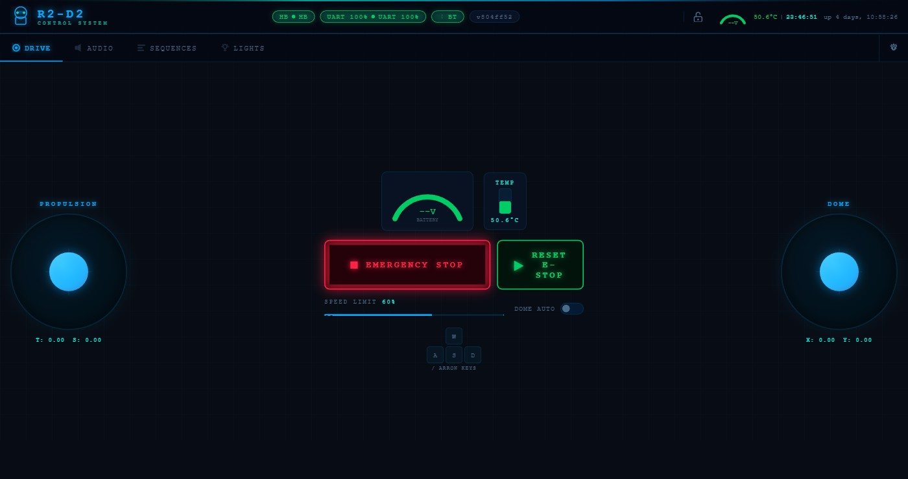

<div align="center">

# 🤖 R2D2_Control

**The R2-D2 control system you've been waiting for.**

[](LICENSE)
[](https://python.org)
[](https://www.raspberrypi.com/)
[](android/compiled/)
[](slave/sounds/)
[](master/sequences/)

*Two Raspberry Pi 4B · UART through slip ring · Web dashboard · Android app · Bluetooth gamepad · 317 authentic sounds · 40 expressive sequences*

</div>

---

## Why this and nothing else?

Most R2-D2 builders end up with a pile of shell scripts, a half-working web interface, and a robot that does one thing at a time. **This isn't that.**

This system was built from the ground up to make R2-D2 feel **alive** — not just remote-controlled. Every subsystem talks to every other subsystem. A single button press can trigger coordinated sound + dome rotation + panel choreography + light sequence simultaneously. The safety system has three independent watchdog layers so the robot *cannot* run away. And the whole thing deploys itself from a single button press on the dome.

If you're building a full-scale R2-D2 and you want a control system that's actually worthy of the build — **this is it**.

> ⚠️ **Work in Progress** — Software is fully functional and battle-tested on bench. Physical assembly (3D parts, slip ring, wiring) still in progress. No camera stream yet.

---

## What is this?

A **complete, production-grade control system** for a 1:1 scale R2-D2 replica. Two Raspberry Pi 4B communicate over a **physical UART through the dome slip ring**, with layered safety watchdogs, a REST API, an Android app, Bluetooth gamepad support, and 40 expressive behavioral sequences that give R2-D2 a real personality.

- **Master Pi** (dome, rotates) — web server, dome servos, LED logics, sequence engine, deploy system, BT gamepad
- **Slave Pi** (body, fixed) — drive motors, body servos, dome rotation motor, 317-sound audio system, diagnostic LCD
- If the link drops for more than 500ms, drive motors **cut immediately** — no runaway robot, ever

The dashboard runs on the Master Pi and is reachable from any phone, tablet, or browser on the local Wi-Fi hotspot. An Android app wraps the same interface with offline detection and network auto-discovery. Or just grab a Bluetooth controller and go.

---

## Screenshots

<table>
<tr>
<td align="center" width="50%">

### 🕹️ Drive
Dual joystick · WASD keyboard · Emergency stop · Live battery gauge



</td>
<td align="center" width="50%">

### 🔊 Audio
317 R2-D2 sounds · 14 mood categories · Random or specific track


</td>
</tr>
<tr>
<td align="center" width="50%">

### 🎬 Sequences
40 behavioral sequences · Loop mode · Emotions, Star Wars themes, patrol…


</td>
<td align="center" width="50%">

### ⚙️ Systems — Panels & Bluetooth
MG90S 180° servos · Per-panel O° / C° / S calibration · BT controller mapping


</td>
</tr>
<tr>
<td align="center" width="50%">

### 💡 Lights
Teeces32 or AstroPixels+ · FLD/RLD/BOTH text · PSI color picker · Light sequences

</td>
<td align="center" width="50%">

### 🔧 Configuration
Wi-Fi hotspot · Auto-deploy · Git branch · System reboot/shutdown


</td>
</tr>
</table>

---

## Features

### 🎭 Expressive Behavioral Sequences

This is where R2-D2 comes alive. 40 sequences combine sounds, servo panels, dome rotation, and lights into **coordinated emotional performances**:

| Sequence | What R2 does |
|----------|-------------|
| `scared` | Panels **tremble** at small angles (35°, speed 8) — nervous micro-movements, not full open |
| `excited` | Panels **snap open and shut** at speed 9, rapid alternating combos, triumphant slow wide open |
| `curious` | Panels **creep open slowly** (speed 2, ~50°) while dome turns — deliberate, peeking |
| `angry` | Panels **slam** instantaneously (speed 10), aggressive clack-clack, then slow menacing close (speed 3) |
| `celebrate` | Dramatic **wave** across panels (speed 4), body + dome panels flowing in sequence |
| `patrol` | Dome wanders randomly, panels peek, random sounds — R2 feels alive on its own |
| `leia` | Full Leia mode (Teeces + iconic sound) |
| `cantina` | Full Cantina Band sequence |
| + 32 more | `march`, `evil`, `malfunction`, `birthday`, `disco`, `dance`, `taunt`, `scan`… |

**Sequences use per-panel calibrated angles automatically** — no magic numbers in the scripts. You calibrate once in the UI, every sequence respects it. And you can override angle and speed inline for mood-specific movement:

```
servo,dome_panel_1,open,40,8    # open to 40° at speed 8 — nervous peek
servo,dome_panel_1,close,20,9   # snap shut at speed 9
servo,dome_panel_2,open         # use calibrated angle + speed from settings
```

Custom sequences and light sequences can be created directly from the **in-browser editor** — drag-and-drop steps, no file editing required.

---

### 🦾 Per-Panel Servo Calibration with Speed Ramp

Every one of the 22 servo panels (11 dome + 11 body) has three independent parameters:

| Field | Description |
|-------|-------------|
| **O°** | Open angle (10–170°) |
| **C°** | Close angle (10–170°) |
| **S**  | Speed 1–10 (1 = slow sweep ~1.2s, 10 = instant) |

The speed ramp is implemented in software — the driver steps 2° at a time with a configurable delay, giving smooth, cinematic movement. `open_all()` / `close_all()` run all panels **in parallel threads** so a full-dome open happens simultaneously, not sequentially.

Settings are saved to two JSON files (`master/config/dome_angles.json` and `slave/config/servo_angles.json`) — each Pi reads its own file at boot, independently of the other. No dependency on network sync at startup.

---

### 🕹️ Control — Every Way You Want

- **Web dashboard** — dark blue R2-D2 theme, 6 tabs, mobile-first responsive layout
- **Android app** — native offline banner, IP auto-discovery (mDNS → saved IP → 192.168.4.1 → subnet scan), haptic feedback
- **WASD / arrow keys** — full keyboard driving from any browser on any OS
- **Bluetooth gamepad** — pair directly to the Pi (no phone middleman), configurable button/axis mapping, deadzone, three speed modes (Normal / Kids / Child Lock), inactivity timeout, fully manageable from the UI (scan · pair · unpair — no SSH needed)

The gamepad connects **directly to the Master Pi via Bluetooth** and is read via Linux evdev — no lag, no browser dependency. Works with Xbox, PS4/PS5, NVIDIA Shield, 8BitDo, and any standard HID gamepad. Press and hold Y to open dome panels, release to close. X for body panels. B for a random R2-D2 sound. Home button triggers E-STOP.

---

### 🔊 Audio

- **317 R2-D2 sounds** in 14 emotional categories — happy, sad, razz, proc, hum, whistle, alarm, scream, ooh, sent, quote, special, extra…
- Playback via `mpg123` on the Pi's native 3.5mm jack
- Volume control with a **perceptual cubic curve** — 50% slider = 79% ALSA (sounds natural, not logarithmic)
- Random-by-category or specific track, STOP command, all controllable from sequences

---

### 💡 Lights

- **Plugin driver architecture** — swap between **Teeces32** (JawaLite protocol) and **AstroPixels+** (@ commands) without rebooting, from the Config tab
- **Live FLD preview** in the dashboard — animated dot grid, card title adapts to active driver
- **Text on FLD / RLD / BOTH** — inline selector in the Lights tab, same as in the sequence editor
- **PSI color swatches** — 8 colors, live preview dots
- **Light sequences** — create choreographed light shows in the visual editor (drag-and-drop, same interface as behavioral sequences), run them from the Lights tab or the Sequences tab
- **RP2040 round LCD** (240×240, GC9A01) — MicroPython firmware, 6 diagnostic screens driven entirely by `DISP:` commands from the Slave Pi:

| Screen | Ring | Content | Triggered by |
|--------|------|---------|--------------|
| **STARTING UP** | 🟠 Orange thick | Spinner + "STARTING UP" | `DISP:BOOT:START` |
| **OPERATIONAL** | 🟢 Green thin | "SYSTEM STATUS: OPERATIONAL" · version · UART bus health bar + % | `DISP:READY:v<hash>` + `DISP:BUS:<pct>` |
| **BUS WARNING** | 🟠 Orange thin | Same + "PARASITES DETECTES" in orange | `DISP:BUS:<pct>` when pct < 80% |
| **NETWORK** | 🔵 Blue / 🟠 Orange | Antenna icon · SCANNING… / CONNECTING / HOME WIFI ACTIVE + IP | `DISP:NET:SCANNING:1` · `DISP:NET:AP:3` · `DISP:NET:HOME:<ip>` |
| **SYSTEM LOCKED** | 🔴 Red flashing | Lock icon · "WATCHDOG TRIGGERED · MOTORS STOPPED" | `DISP:LOCKED` |
| **TELEMETRY** | 🔵 Blue thin | Voltage + LiPo % bar · Temperature + bar *(swipe from OPERATIONAL)* | `DISP:TELEM:24.5V:45C` |

  Swipe left/right navigates between OPERATIONAL and TELEMETRY. All other states block navigation.
  Screen design reference: [`docs/rp2040-mockup.html`](docs/rp2040-mockup.html)

---

### 🛡️ Safety — Three Independent Watchdog Layers + E-STOP

No single point of failure can leave the robot moving uncontrolled:

| Layer | Timeout | Triggers when |
|-------|---------|---------------|
| **App watchdog** | 600 ms | Browser closed, phone screen off, Wi-Fi drop |
| **Drive timeout** | 800 ms | No drive command while moving |
| **UART watchdog** | 500 ms | Master crash, slip ring disconnected |

All three trigger a **graceful decel ramp** — velocity proportional to current speed (max 400 ms at full speed), never an abrupt stop that could tip the robot.

**Emergency Stop button** (always visible, Space bar shortcut) instantly cuts all servo PWM by putting both PCA9685 chips to SLEEP. A **RESET E-STOP** button re-arms the drivers without restarting the service — servos are operational again in under a second.

---

### 🚀 Deployment System

```
Dome button short press  →  git pull + rsync Slave + reboot
Dome button long press   →  git rollback (HEAD^) + rsync + reboot
Double press             →  display current version on Teeces + RP2040
```

On boot, the Slave requests the Master's git hash over UART and re-syncs if there's a mismatch. The whole two-Pi update cycle is fully automatic and requires no SSH access.

---

### Architecture

```
┌─────────────────────────────────────────────────────────────────┐
│  📱 Phone / PC  ←── Wi-Fi (192.168.4.1:5000) ──→  🎩 MASTER Pi  │
│                                                                  │
│  R2-MASTER (Dome — rotates)          R2-SLAVE (Body — fixed)    │
│  ├─ Flask REST API :5000             ├─ UART listener            │
│  ├─ Script engine (40 sequences)     ├─ Watchdog 500ms → VESCs  │
│  ├─ Dome servos   I2C 0x40          ├─ Body servos  I2C 0x41   │
│  ├─ Lights plugin (Teeces/AstroP.)  ├─ Dome motor   I2C 0x40   │
│  └─ Deploy controller               ├─ Drive VESCs  USB ×2     │
│                                     ├─ Audio        3.5mm jack  │
│         UART 115200 baud            └─ RP2040 LCD   USB        │
│    ←─── through slip ring ────►                                 │
│    (heartbeat every 200ms + CRC checksum)                       │
└─────────────────────────────────────────────────────────────────┘
```

### Hardware at a glance

| | **Master Pi 4B 4GB** (Dome) | **Slave Pi 4B 2GB** (Body) |
|---|---|---|
| **Servos** | 11 dome panels — MG90S 180° — PCA9685 @ 0x40 | 11 body panels — MG90S 180° — PCA9685 @ 0x41 |
| **Motors** | — | 2× 250W hub motors via 2× FSESC Mini 6.7 PRO |
| **Dome motor** | — | DC motor via TB6612 HAT @ I2C 0x40 |
| **LEDs** | Teeces32 or AstroPixels+ via USB | — |
| **Audio** | — | 317 sounds, 3.5mm jack, mpg123 |
| **Diagnostic display** | — | RP2040 Waveshare 1.28" 240×240 round LCD |
| **Power** | 5V/10A Tobsun buck → GPIO 2&4 | 5V/10A + 12V/10A Tobsun bucks |
| **Battery** | ← 24V via slip ring (3 wires parallel) | 6S LiPo 22.2V — XT90-S anti-spark |

📐 **[Full electronics diagrams, power wiring & protocol reference →](ELECTRONICS.md)**

---

## Quick Start

### Prerequisites

- 2× Raspberry Pi 4B (username: `artoo` — configure in Raspberry Pi Imager)
- Both running **Raspberry Pi OS Trixie** (64-bit)
- USB Wi-Fi dongle on the Master Pi (internet on wlan1 while hosting hotspot on wlan0)
- Both Pis connected to your home Wi-Fi for initial setup

### Installation

The entire setup is automated. Two scripts, each run once per Pi.

#### Step 1 — Master Pi

Connect the Master Pi to your home Wi-Fi, then run:

```bash
curl -fsSL https://raw.githubusercontent.com/RickDnamps/R2D2_Control/main/scripts/setup_master.sh | sudo bash
```

This script handles everything automatically:
- System update + package installation
- Git clone of this repo to `/home/artoo/r2d2`
- UART fix (`dtoverlay=miniuart-bt` — keeps BT working for the gamepad)
- Hardware UART + I2C activation via `raspi-config`
- Python dependencies (`master/requirements.txt`)
- Hotspot configuration (wlan0 = `R2D2_Control` @ 192.168.4.1, wlan1 = home internet)
- SSH key generation for passwordless Slave deploy
- systemd services (`r2d2-master`, `r2d2-monitor`) enabled and ready
- Reboot

#### Step 2 — Slave Pi

Connect the Slave Pi to your home Wi-Fi (or to the Master's hotspot after step 1), then run:

```bash
curl -fsSL https://raw.githubusercontent.com/RickDnamps/R2D2_Control/main/scripts/setup_slave.sh | sudo bash
```

This script handles:
- System update + package installation (`mpg123` for MP3 playback)
- UART fix (`dtoverlay=disable-bt`)
- Hardware UART + I2C activation
- Network setup (wlan0 connects to `R2D2_Control` hotspot)
- ALSA audio config (3.5mm jack, volume 100%)
- Reboot

#### Step 3 — First Deploy (from Master)

Once the Slave has rebooted and connected to the hotspot, run this once from the Master:

```bash
# Copy SSH key to Slave (passwordless deploy)
ssh-copy-id artoo@192.168.4.171

# First deployment: rsync code + install Python deps + install systemd services
bash /home/artoo/r2d2/scripts/deploy.sh --first-install
```

This rsync's all the code to the Slave, installs Python dependencies offline (from a local vendor cache pre-built on the Master), installs and starts `r2d2-slave.service`.

#### Done

Access the dashboard at **`http://192.168.4.1:5000`** from any device connected to the `R2D2_Control` hotspot.

📖 **[Full installation guide (English) →](HOWTO_EN.md)** · [Guide d'installation (Français) →](HOWTO.md)

### Updates

To update both Pis to the latest version:

```bash
# On the Master — git pull + rsync Slave + restart everything
bash /home/artoo/r2d2/scripts/update.sh
```

Or press the physical dome button (short press). The system updates itself over-the-air without any SSH.

### Android App

Download [`android/compiled/R2-D2_Control.apk`](android/compiled/R2-D2_Control.apk), enable *Install from unknown sources*, install and launch. The app auto-discovers the Master Pi — tries mDNS first, then saved IP, then scans the subnet.

---

## Repository Structure

```
r2d2/
├── master/
│   ├── main.py              — Boot sequence + service init
│   ├── script_engine.py     — Sequence runner (background threads)
│   ├── lights/              — Plugin driver system
│   │   ├── base_controller.py — Abstract interface (BaseLightsController)
│   │   ├── teeces.py          — Teeces32 JawaLite driver
│   │   └── astropixels.py     — AstroPixels+ @ command driver
│   ├── drivers/             — DomeServoDriver, DomeMotorDriver (speed ramp, I2C smbus2)
│   ├── api/                 — Flask blueprints: audio, motion, servo, sequences, lights, status
│   ├── sequences/           — 40 behavioral sequences (.scr CSV format)
│   ├── light_sequences/     — Custom light show sequences (.lseq CSV format)
│   ├── config/
│   │   ├── dome_angles.json — Per-panel open/close/speed — read at boot, written by web UI
│   │   └── main.cfg / local.cfg
│   ├── templates/           — Web dashboard (dark blue R2-D2 theme)
│   └── static/              — CSS + JavaScript (same files bundled in Android app)
├── slave/
│   ├── main.py
│   ├── watchdog.py          — UART heartbeat watchdog → cuts VESCs at 500ms
│   ├── drivers/             — BodyServoDriver (speed ramp), VescDriver, AudioDriver, DisplayDriver
│   ├── config/
│   │   └── servo_angles.json — Body panel open/close/speed — independent from Master
│   └── sounds/              — sounds_index.json (317 MP3 files gitignored — stored on Pi)
├── shared/
│   └── uart_protocol.py     — CRC checksum, build_msg(), parse_msg()
├── rp2040/firmware/         — MicroPython: GC9A01 display, OPERATIONAL/LOCKED/TELEM screens
├── android/
│   ├── app/src/main/assets/ — Bundled web assets (works offline from file://)
│   └── compiled/            — R2-D2_Control.apk ← ready to install
└── scripts/
    ├── setup_master.sh      — Full Master installation (one command)
    ├── setup_slave.sh       — Full Slave installation (one command)
    ├── deploy.sh            — First Slave deploy (rsync + deps + services)
    └── update.sh            — Ongoing updates (git pull + rsync + restart)
```

---

## Sequence Format

Sequences are plain `.scr` CSV files in `master/sequences/` — easy to read, write, and share. Light sequences use `.lseq` files in `master/light_sequences/` (same format, lights-only commands):

```
# This is a comment
sound,RANDOM,happy                       # random sound from a category
sound,Theme001                           # specific sound file
servo,dome_panel_1,open                  # use calibrated angle + speed
servo,dome_panel_1,open,40,8            # override angle (40°) and speed (8)
servo,dome_panel_1,close,20,9           # close to 20° at speed 9
servo,all,open                           # all panels simultaneously (parallel)
dome,turn,0.5                            # dome rotation -1.0…+1.0
dome,random,on                           # autonomous dome wander
teeces,random                            # lights: random animations
teeces,text,HELLO WORLD,fld             # text on FLD (or rld / both)
teeces,psi,1                             # PSI mode
teeces,anim,11                           # specific T-code animation
sleep,1.5                                # pause (seconds, float)
sleep,random,0.5,2.0                     # random pause between min and max
motion,STOP                              # emergency stop propulsion
```

Both sequence types can be **created and edited visually** in the Editor tab — drag-and-drop command palette, no file editing required.

---

## Development Roadmap

| Phase | Description | Status |
|-------|-------------|--------|
| **1** | Infrastructure: UART + CRC, heartbeat watchdog, audio, Teeces32, RP2040 display, auto-deploy | ✅ Complete |
| **2** | Propulsion: VESCs, dome motor, MG90S servo panels with speed ramp | 🔧 Code complete — hardware assembly in progress |
| **3** | Script engine: 40 expressive behavioral sequences | ✅ Active |
| **4** | REST API + Web dashboard (6 tabs) + Android app | ✅ Active |
| **4+** | Servo calibration UI · Sequence editor · Light editor · Lights plugin (Teeces/AstroPixels+) · Bluetooth gamepad (evdev) · BT pairing UI | ✅ Active |
| **5** | Vision: USB camera stream, person tracking | 📋 Planned |

> Physical assembly in progress — 3D parts printing, slip ring ordered. All testing currently on bench with direct BCM14/15 UART wiring.

---

## Credits & Inspiration

- Sound library and `.scr` script format inspired by **[r2_control by dpoulson](https://github.com/dpoulson/r2_control)** — 306 R2-D2 sounds + the original script thread concept
- R2-D2 Builders Club community for hardware knowledge and dome geometry

## License

**GNU GPL v3** — see [LICENSE](LICENSE).
Free to use, modify and share — keep it open source.

---

<div align="center">

**Built for builders who won't settle for half-measures.**

*May the Force be with you.* 🌟

[⭐ Star this repo](https://github.com/RickDnamps/R2D2_Control) · [🐛 Report an issue](https://github.com/RickDnamps/R2D2_Control/issues) · [📖 Electronics →](ELECTRONICS.md)

</div>
