<div align="center">

# 🤖 R2D2_Control

**The R2-D2 control system you've been waiting for.**

[](LICENSE)
[](https://python.org)
[](https://www.raspberrypi.com/)
[](android/compiled/)
[](slave/sounds/)
[](master/sequences/)
[](master/api/)

*Two Raspberry Pi 4B · UART through slip ring · Full web dashboard · Android app · Bluetooth gamepad · 317 authentic sounds · 40 expressive sequences · Choreography timeline editor · Kids Lock · Child Lock*

</div>

---

## Why this and nothing else?

Most R2-D2 builders end up with a pile of shell scripts, a half-working web interface, and a robot that does one thing at a time. **This isn't that.**

This system was built from the ground up to make R2-D2 feel **alive** — not just remote-controlled. A single button press triggers coordinated sound + dome rotation + panel choreography + light sequence simultaneously. The safety system has three independent watchdog layers so the robot *cannot* run away. Kids Lock limits speed for young pilots. Child Lock blocks all motion when R2 is on display. Everything deploys itself from a single button press on the dome.

If you're building a full-scale R2-D2 and you want a control system actually worthy of the build — **this is it**.

> ⚠️ **Work in Progress** — Software fully functional and battle-tested on bench. Physical assembly in progress (3D parts printing, slip ring ordered). No camera stream yet.

---

## What is this?

A **complete, production-grade control system** for a 1:1 scale R2-D2 replica. Two Raspberry Pi 4B communicate over a **physical UART through the dome slip ring**, with layered safety watchdogs, a REST API, an Android app, Bluetooth gamepad support, and 40 expressive behavioral sequences that give R2-D2 a real personality.

- **Master Pi 4B** (dome, rotates) — Flask REST API, web dashboard, dome servos & panels, LED logics, visual editors, BT gamepad
- **Slave Pi 4B** (body, fixed) — Drive motors (dual VESC), body servo panels, dome rotation motor, 317-sound audio system, RP2040 diagnostic LCD
- If the UART link drops for more than 500ms, drive motors **cut immediately** — no runaway robot, ever

The dashboard runs on the Master Pi and is reachable from any phone, tablet, or browser on the local Wi-Fi hotspot. An Android app wraps the same interface with offline detection and network auto-discovery. A Bluetooth gamepad pairs directly to the Pi — no phone middleman, zero lag.

---

## Screenshots

<table>
<tr>
<td align="center" width="50%">

### 🕹️ Drive
Dual joystick · WASD keyboard · Emergency stop · Live battery gauge · Speed limiter

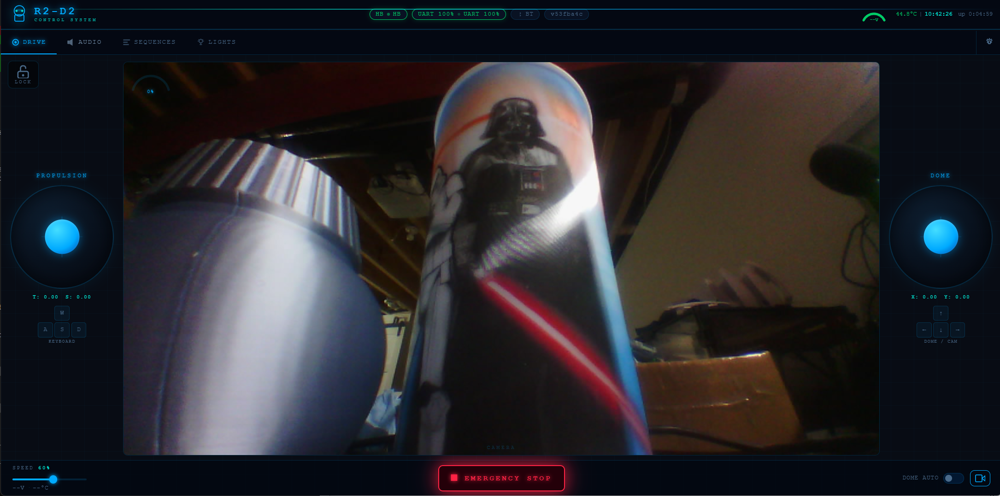

</td>
<td align="center" width="50%">

### 🔊 Audio
317 R2-D2 sounds · 14 mood categories · Animated waveform · Volume with perceptual curve

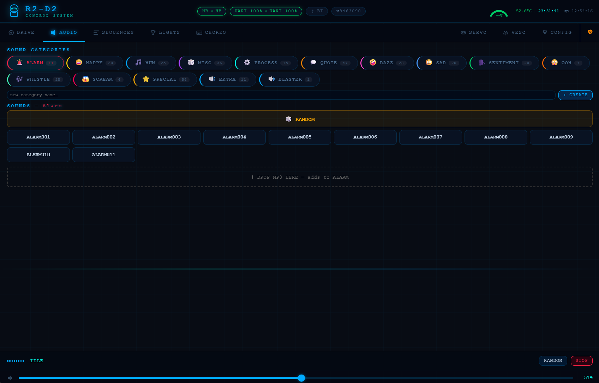

</td>
</tr>
<tr>
<td align="center" width="50%">

### 🟡 Kids Lock
Speed capped at configurable % — great for shows with young pilots

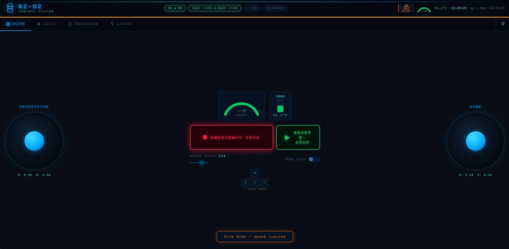

</td>
<td align="center" width="50%">

### 🔴 Child Lock
All motion blocked — R2 on display safely, lights & sounds still work

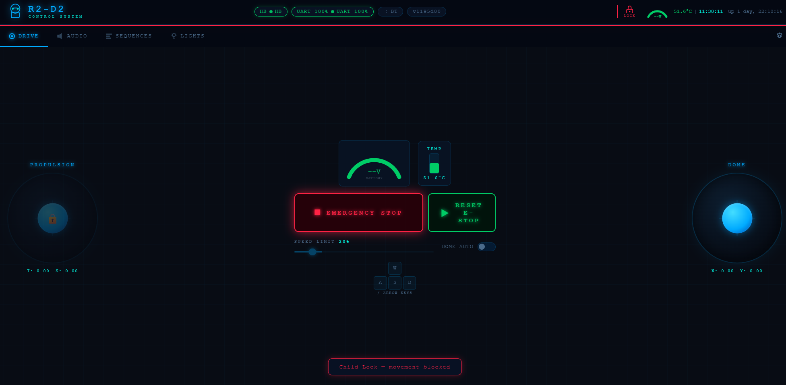

</td>
</tr>
<tr>
<td align="center" width="50%">

### 🎬 Sequences
40 behavioral sequences · Custom sequences · Loop mode · Running status

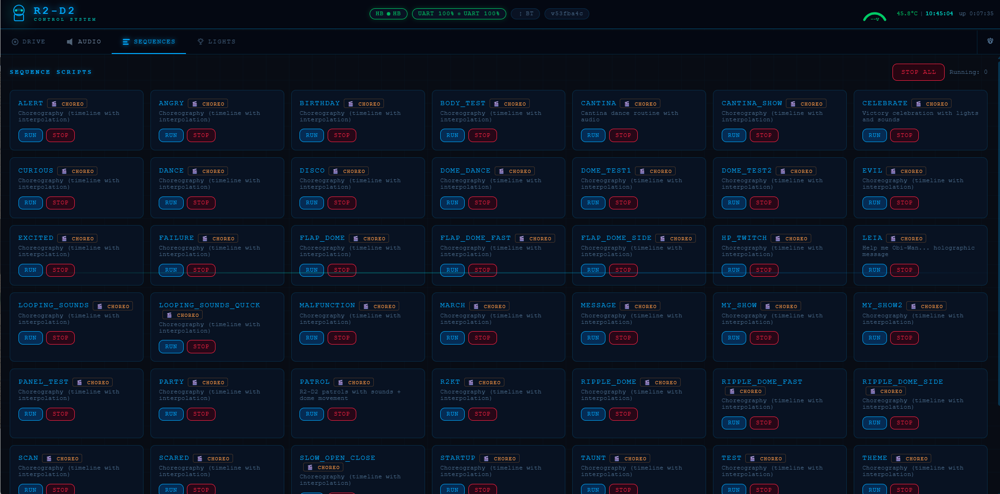

</td>
<td align="center" width="50%">

### 💡 Lights
Teeces32 or AstroPixels+ · 22 animations · FLD/RLD/BOTH text · PSI sequences

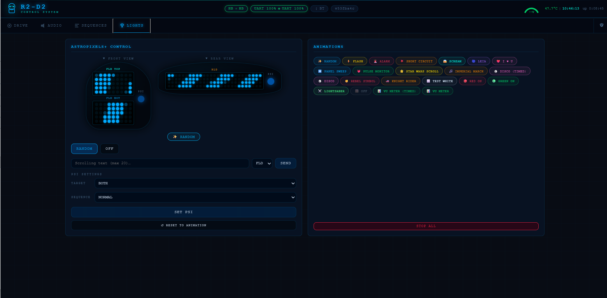

</td>
</tr>
<tr>
<td align="center" width="50%">

### ✏️ Sequence Editor (admin)
Drag-and-drop step builder · Command palette · Per-command builders · Test without saving

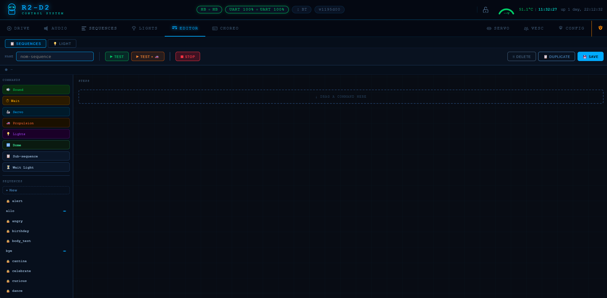

</td>
<td align="center" width="50%">

### 🎼 Choreography Timeline Editor
Multi-track timeline · Drag-and-drop blocks · Digital Twin monitor · VESC telemetry gauges

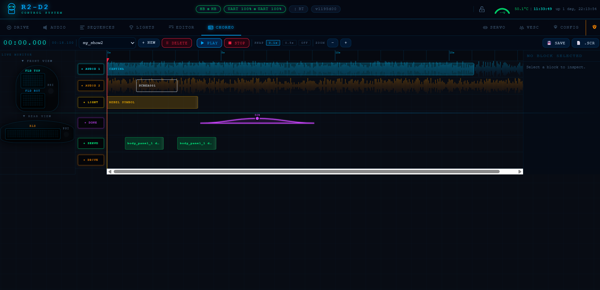

</td>
</tr>
<tr>
<td align="center" width="50%">

### 🦾 Servo Calibration
Hardware IDs (Servo_M0/Servo_S0) · Editable labels · Per-panel open/close/speed · Saved to JSON

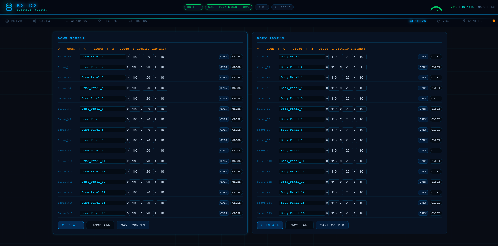

</td>
</tr>
<tr>
<td align="center" width="50%">

### 🔧 Config — Bluetooth & Gamepad
BT scan/pair/unpair · Button remapping · Deadzone · Inactivity timeout

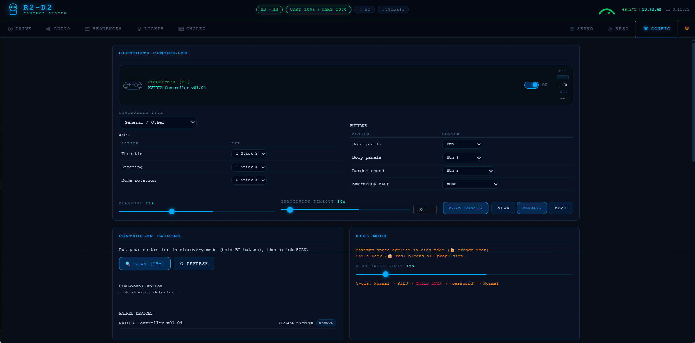

</td>
<td align="center" width="50%">

### ⚙️ Config — Wi-Fi & Others
Hotspot · Home Wi-Fi · Lights driver hot-swap · Battery cell count · Auto-deploy · Git branch

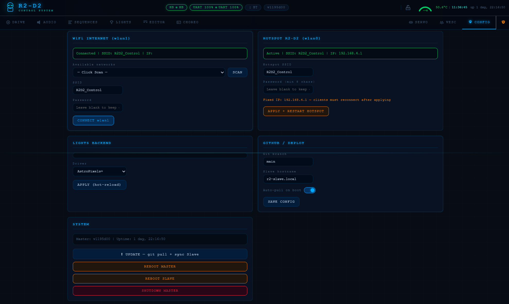

</td>
</tr>
<tr>
<td align="center" width="50%">

### 📊 VESC Minimal Config
Voltage · temperature · RPM · duty · fault codes — minimal setup reference

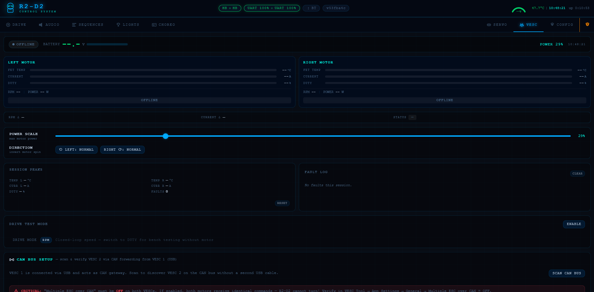

</td>
<td align="center"></td>
</tr>
</table>

---

## Features at a Glance

| | |
|---|---|
| 🎭 **40 behavioral sequences** | Coordinated sound + panels + dome + lights — one-click in SEQUENCES tab |
| 🎼 **Choreography timeline editor** | Multi-track drag-and-drop · VESC motion · audio · servos · lights in sync |
| 🔌 **Plug-in lights** | Swap Teeces32 ↔ AstroPixels+ hot, no reboot |
| 🎮 **Bluetooth gamepad** | Xbox/PS4/8BitDo — direct to Pi, zero lag |
| 📱 **Android app** | Offline banner · IP auto-discovery · full-screen |
| 🔒 **Kids Lock / Child Lock** | Speed cap or full motion block, password-protected |
| 🛡️ **Triple watchdog** | App 600ms · Drive 800ms · UART 500ms |
| 🚨 **E-Stop** | Space bar shortcut · hard-cuts all PWM instantly |
| 🚀 **One-button deploy** | Dome button → git pull + rsync Slave + reboot |
| 🌐 **60+ REST endpoints** | Full API for every subsystem |
| 🔊 **317 sounds · 14 moods** | Perceptual volume curve · random by category |
| 🦾 **22 servo panels** | Hardware IDs (Servo_M0/Servo_S0) · editable labels · per-panel calibration |
| 📊 **VESC telemetry** | Voltage · temp · RPM · duty · fault codes live — battery gauge auto-scaled by cell count |
| 🖥️ **RP2040 LCD** | 6 diagnostic screens driven by UART commands |

---

## 🎼 Choreography Timeline Editor

The **CHOREO tab** is the main authoring tool. Build multi-track timelines that synchronize every subsystem in real time: VESC drive motion, servo panels, dome rotation, audio (up to 12 simultaneous tracks), and lights — with drag-and-drop blocks, easing curves, and a Digital Twin preview.

Telemetry abort safeguards: ChoreoPlayer monitors VESC voltage (min = cells × 3.5V), temperature (max 80°C), current (max 30A), and UART reliability (3 consecutive failures). Any threshold breach stops the sequence and logs the reason, readable via `GET /choreo/status`.

---

## 🎭 Built-in Behavioral Sequences

40 legacy `.scr` sequences are still available in the **SEQUENCES tab** — one-click launch of coordinated emotional performances (sound + panels + dome + lights):

| Sequence | What R2 does |
|----------|-------------|
| `scared` | Panels **tremble** at 35° (speed 8) — nervous micro-movements |
| `excited` | Panels **snap** open/shut at speed 9, rapid alternating combos |
| `curious` | Panels **creep** open (speed 2, ~50°) while dome turns |
| `angry` | Panels **slam** at speed 10, aggressive clack-clack |
| `celebrate` | Dramatic wave across panels, body + dome flowing in sequence |
| `patrol` | Dome wanders randomly, panels peek, random sounds |
| `leia` | Full Leia hologram mode — Teeces + iconic audio |
| `cantina` | Full Cantina Band routine |
| `march` | Imperial March with lights and dome movements |
| `malfunction` | Alarm animations + panic sounds + dome spins |
| + 30 more | `evil`, `birthday`, `disco`, `dance`, `taunt`, `scan`, `startup`… |

`.scr` files are plain CSV in `master/sequences/`. Available commands: `sleep` · `sound` · `servo` · `dome` · `motion` · `teeces`. Sequences use per-panel calibrated angles automatically — calibrate once in the Servo tab, every sequence respects it.

---

## 💡 Lights Tab — 22 Animations + AstroPixels+ Controls

### 22 Built-in T-code Animations — one click away in the Lights tab:

| # | Animation | # | Animation |
|---|-----------|---|-----------|
| 1 | Random | 12 | Disco (timed) |
| 2 | Flash | 13 | Disco |
| 3 | Alarm | 14 | Rebel Symbol |
| 4 | Short Circuit | 15 | Knight Rider |
| 5 | Scream | 16 | Test White |
| 6 | Leia Message | 17 | Red On |
| 7 | I Heart U | 18 | Green On |
| 8 | Panel Sweep | 19 | Lightsaber |
| 9 | Pulse Monitor | 20 | Off |
| 10 | Star Wars Scroll | 21 | VU Meter (timed) |
| 11 | Imperial March | 92 | VU Meter |

**Text display** — send scrolling text to `fld_top`, `fld_bottom`, `fld_both`, `rld`, or `all`. Target selector inline in the Lights tab.

**PSI control** — select target (`both/fpsi/rpsi`) and sequence (`normal/flash/alarm/failure/redalert/leia/march`). PSI is independent of T-code animations on AstroPixels+.

> ⚠️ **AstroPixels+ note:** Only 8 of the 22 T-codes are supported via serial (`@0T`): T1, T2, T3, T4, T5, T6, T11, T20. All 22 work on Teeces32. The UI automatically shows only supported codes for your connected hardware.

---

## 🔌 Plug-in Light Drivers

The lights system uses a **driver plugin architecture** — swap hardware without touching the code.

| Driver | Protocol | Command |
|--------|----------|---------|
| **Teeces32** | JawaLite serial (9600 baud) | `0T{n}\r`, `1M{text}\r` |
| **AstroPixels+** | @ commands (USB serial) | `@0T{n}\r`, `@3M{text}\r` |

Switch drivers **hot**, from the Config tab — no reboot, no SSH. The old driver shuts down cleanly, the new one initializes and starts in random mode.

---

## 🎮 Bluetooth Gamepad — Direct to Pi

The gamepad connects **directly to the Master Pi via Bluetooth** using Linux evdev — no phone relay, no extra hardware, zero lag.

Compatible with Xbox Series, PS4/PS5, Nintendo Switch Pro, NVIDIA Shield, 8BitDo, and any standard HID gamepad.

**Default mapping:**

| Input | Action |
|-------|--------|
| Left stick Y | Forward / reverse propulsion |
| Left stick X | Left / right steering |
| Right stick X | Dome rotation |
| Hold Y (□) | Open dome panels → release to close |
| Hold X (△) | Open body panels → release to close |
| B (○) | Random R2-D2 sound |
| Home / Options | Emergency stop |
| R1 (turbo) | Speed boost multiplier |

**Fully configurable from the web UI** — remap any button, adjust deadzone, set inactivity timeout (auto-stop after N seconds idle), all without SSH.

---

## 🔒 Kids Lock & Child Lock

Three operating modes, switchable from the dashboard header (password-protected):

| Mode | Icon | Effect |
|------|------|--------|
| **Normal** | 🟢 | Full speed, all controls active |
| **Kids** | 🟡 | Speed capped (configurable, default 50%) — great for shows with young pilots |
| **Child Lock** | 🔴 | All motion completely blocked — R2 can be displayed safely, lights & sounds still work |

- Lock/unlock from the UI **or from the BT gamepad**
- Lock mode applies to **both web and Bluetooth** inputs simultaneously
- Servos, audio, and lights remain fully operational in all modes

---

## 🛡️ Safety — Triple Watchdog + E-STOP

No single point of failure can leave the robot moving uncontrolled:

| Layer | Timeout | Triggers when |
|-------|---------|---------------|
| **App watchdog** | 600 ms | Browser closed, phone screen off, Wi-Fi drop |
| **Drive timeout** | 800 ms | No drive command received while motors are spinning |
| **UART watchdog** | 500 ms | Master crash, slip ring disconnected, Slave offline |

All three trigger a **graceful decel ramp** — velocity proportional to current speed (max 400ms at full speed), never an abrupt stop that could tip the robot.

**Emergency Stop** (red button, always visible — or press Space):
- Instantly puts both PCA9685 chips to SLEEP → hard-cuts all servo PWM
- `RESET E-STOP` button re-arms the drivers in under a second — no service restart needed

---

## 📱 Android App

A native Android app wraps the full dashboard with mobile-optimized extras:

- **Full-screen immersive mode** — hides navigation bars, swipe to reveal
- **Offline banner** — immediate visual feedback when connection drops
- **Auto-discovery** — tries mDNS → saved IP → 192.168.4.1 → subnet scan
- **Configurable host** — long-press to change Master IP
- **Haptic feedback** on key actions
- **Works offline** — all assets bundled locally, no internet required on the phone

Download [`android/compiled/R2-D2_Control.apk`](android/compiled/R2-D2_Control.apk) — enable *Install from unknown sources*, install, launch.

---

## 🚀 Deployment System

```
Dome button — short press  →  git pull (if internet) + rsync Slave + reboot
Dome button — long press   →  rollback to previous commit + rsync + reboot
Dome button — double press →  display current git hash on Teeces LEDs
```

**`update.sh`** — the same full update cycle from the command line:
1. Backup custom sequences
2. `git pull` (skipped if wlan1 not available)
3. Restore custom sequences
4. Verify Slave is reachable
5. `rsync slave/ + shared/ + scripts/ + rp2040/ + VERSION` → Slave
6. Restart Slave service
7. Restart Master service
8. Verify both services healthy + API responding

The Slave checks version on boot — if it mismatches, it requests a resync automatically.

---

## Architecture

### Why Two Raspberry Pi 4B?

The Master + Slave split is a deliberate design decision, not just a workaround for cable routing through the slip ring.

**The real-time problem.** R2-D2 has two physically separate worlds: the dome (servos, lights, Teeces, web server, Bluetooth) and the body (drive motors, body servos, audio, LCD). Putting everything on one Pi means a spike in Flask/Python GIL or a slow sequence could delay motor watchdog responses. With two Pis, the Slave's 500ms UART watchdog runs independently — even if the Master crashes, the Slave cuts the VESCs automatically.

**The future: AI and computer vision.** The main reason for choosing 4GB on the Master is headroom for what comes next:
- **Facial recognition** — detect and track a face, orient the dome toward the person
- **Gesture recognition** — respond to waves, pointing, specific poses
- **Behavioral AI** — generate contextually appropriate reactions (sounds, panel movements, dome orientation) based on what R2 perceives, making the robot feel genuinely alive rather than scripted

These workloads are CPU/RAM-intensive and run continuously in the background. Isolating them on the Master means they never interfere with the real-time motor control on the Slave.

**Pi 5 upgrade path.** If AI inference becomes a bottleneck on Pi 4B (especially running a small vision model or ONNX runtime), only the Master needs upgrading — the Slave keeps its Pi 4B 2GB forever since it does pure real-time I/O. The UART protocol between them doesn't change. This is also why the Master has 4GB (AI/CV headroom) while the Slave has only 2GB (real-time I/O, no AI workloads).

```
┌────────────────────────────────────────────────────────────────────┐
│  📱 Phone / Tablet / PC  ←── Wi-Fi (192.168.4.1:5000)             │
│  🤖 Android App          ←── IP auto-discovery                     │
│  🎮 BT Gamepad           ←── Bluetooth (evdev, direct to Pi)       │
│                                                                     │
│  ┌──────────────────────────┐   ┌───────────────────────────────┐  │
│  │  R2-MASTER (Dome)        │   │  R2-SLAVE (Body)              │  │
│  │  Pi 4B — 4GB             │   │  Pi 4B — 2GB                  │  │
│  │                          │   │                               │  │
│  │  Flask REST API :5000    │   │  UART listener + CRC          │  │
│  │  Script engine           │   │  Watchdog 500ms → VESCs       │  │
│  │  Light engine (parallel) │   │  Body servos PCA9685 @0x41    │  │
│  │  Dome servos @0x40       │   │  Dome motor TB6612 @0x40      │  │
│  │  Lights plugin           │   │  Drive VESCs (USB+CAN, ERPM)  │  │
│  │  BT Controller (evdev)   │   │  Audio mpg123 (317 sounds)    │  │
│  │  Deploy controller       │   │  RP2040 GC9A01 LCD (USB)      │  │
│  └──────────────────────────┘   └───────────────────────────────┘  │
│              │                               │                      │
│              └── UART 115200 baud ──────────►│                      │
│                  through slip ring           │                      │
│                  heartbeat 200ms + CRC       │                      │
└────────────────────────────────────────────────────────────────────┘
```

### Hardware at a Glance

| | **Master Pi 4B 4GB** (Dome) | **Slave Pi 4B 2GB** (Body) |
|---|---|---|
| **Servos** | 11 dome panels — MG90S 180° — PCA9685 @ 0x40 | 11 body panels — MG90S 180° — PCA9685 @ 0x41 |
| **Motors** | — | 2× 250W hub motors via 2× FSESC Mini 6.7 PRO |
| **Dome motor** | — | DC motor via TB6612 HAT @ I2C 0x40 |
| **LEDs** | Teeces32 or AstroPixels+ via USB | — |
| **Audio** | — | 317 MP3 sounds · 3.5mm jack · mpg123 |
| **Display** | — | RP2040 Waveshare 1.28" 240×240 round LCD |
| **Power** | 5V/10A Tobsun buck → GPIO 2&4 | 5V/10A + 12V/10A Tobsun bucks |
| **Battery** | ← 24V via slip ring (3 wires parallel) | 6S LiPo 22.2V — XT90-S anti-spark |

📐 **[Full electronics diagrams, power wiring & I2C/GPIO reference →](ELECTRONICS.md)**

---

## RP2040 Diagnostic LCD

The Slave drives a 240×240 GC9A01 round display via MicroPython firmware. Six distinct screens, all controlled remotely by UART `DISP:` commands from the Master — no display logic runs on the Slave CPU:

| Screen | Ring | Content |
|--------|------|---------|
| **STARTING UP** | 🟠 Orange thick | Spinner + "STARTING UP" |
| **OPERATIONAL** | 🟢 Green thin | "SYSTEM STATUS: OPERATIONAL" · version · UART bus health bar |
| **BUS WARNING** | 🟠 Orange thin | Same + "PARASITES DETECTES" when CRC health < 80% |
| **NETWORK** | 🔵/🟠 | SCANNING · CONNECTING · HOME WIFI ACTIVE + IP |
| **SYSTEM LOCKED** | 🔴 Flashing | "WATCHDOG TRIGGERED · MOTORS STOPPED" |
| **TELEMETRY** | 🔵 Blue | Voltage + LiPo % · Temperature bar *(swipe from OPERATIONAL)* |

Swipe left/right navigates between OPERATIONAL and TELEMETRY. All other states block navigation until cleared.

---

## Quick Start

### Prerequisites

- 2× Raspberry Pi 4B (username: `artoo` — set in Raspberry Pi Imager)
- Both running **Raspberry Pi OS Trixie** (64-bit)
- USB Wi-Fi dongle on the Master Pi (internet on wlan1 while hosting hotspot on wlan0)
- Both Pis on your home Wi-Fi for first-time setup

### Installation — Two Scripts, Fully Automated

#### Step 1 — Master Pi

Connect the Master to your home Wi-Fi, then run one command:

```bash
curl -fsSL https://raw.githubusercontent.com/RickDnamps/R2D2_Control/main/scripts/setup_master.sh | sudo bash
```

**What it does automatically:**
- System update + all package dependencies
- `git clone` this repo to `/home/artoo/r2d2`
- UART fix (`dtoverlay=miniuart-bt` — Bluetooth stays active for the gamepad)
- Hardware UART + I2C activation via `raspi-config`
- Python dependencies from `master/requirements.txt`
- Hotspot setup (wlan0 = `R2D2_Control` @ 192.168.4.1 · wlan1 = home internet)
- SSH key generation for passwordless Slave deploy
- `r2d2-master` + `r2d2-monitor` systemd services — enabled and ready
- Reboot

#### Step 2 — Slave Pi

Connect the Slave to your home Wi-Fi (or directly to the Master's hotspot), then:

```bash
curl -fsSL https://raw.githubusercontent.com/RickDnamps/R2D2_Control/main/scripts/setup_slave.sh | sudo bash
```

**What it does automatically:**
- System update + `mpg123` for MP3 playback
- UART fix (`dtoverlay=disable-bt`)
- Hardware UART + I2C activation
- Network setup (connects to `R2D2_Control` hotspot)
- ALSA audio config — 3.5mm jack, volume 100%
- Reboot

#### Step 3 — First Deploy (from Master, once)

After the Slave reboots and connects to the hotspot:

```bash
# Authorize passwordless SSH from Master → Slave
ssh-copy-id artoo@192.168.4.171

# First deploy: rsync code + Python deps (offline from local cache) + systemd services
bash /home/artoo/r2d2/scripts/deploy.sh --first-install
```

**Done.** Open **`http://192.168.4.1:5000`** on any device connected to `R2D2_Control`.

📖 **[Full installation guide (English) →](HOWTO_EN.md)** · [Guide d'installation (Français) →](HOWTO.md)

### Updates

```bash
# On the Master — full update cycle in one command
bash /home/artoo/r2d2/scripts/update.sh
```

Or press the physical dome button (short press). The system updates itself over-the-air — no SSH required.

---

## Repository Structure

```
r2d2/
├── master/
│   ├── main.py                    — Boot sequence + service orchestration
│   ├── script_engine.py           — Multi-threaded sequence runner
│   ├── lights/                    — Plugin driver system
│   │   ├── base_controller.py     — Abstract interface (22 animations, backward compat)
│   │   ├── teeces.py              — Teeces32 JawaLite driver
│   │   └── astropixels.py         — AstroPixels+ @ command driver
│   ├── drivers/
│   │   ├── dome_servo_driver.py   — PCA9685 @ 0x40, speed ramp, per-panel calibration
│   │   ├── body_servo_driver.py   — Body panels via UART SRV: commands
│   │   ├── dome_motor_driver.py   — Dome rotation via UART D: commands
│   │   └── bt_controller_driver.py — Linux evdev BT gamepad, Kids/Child Lock
│   ├── api/                       — 8 Flask blueprints (60+ endpoints)
│   │   ├── audio_bp.py            — 317 sounds, categories, volume
│   │   ├── motion_bp.py           — Drive + dome + lock mode enforcement
│   │   ├── script_bp.py           — Sequences CRUD + run/stop
│   │   ├── light_bp.py            — Light sequences CRUD + run/stop
│   │   ├── teeces_bp.py           — Lights control + animation trigger
│   │   ├── servo_bp.py            — 22 panels open/close + calibration save
│   │   ├── settings_bp.py         — WiFi, hotspot, config, lights hot-swap
│   │   ├── status_bp.py           — System status, e-stop, lock, reboot
│   │   └── vesc_bp.py             — VESC telemetry, power scale, CAN scan
│   ├── sequences/                 — 40 built-in behavioral sequences (.scr)
│   ├── light_sequences/           — Legacy .lseq files (used by lseq command in .scr sequences)
│   ├── config/
│   │   ├── main.cfg               — Default configuration
│   │   ├── local.cfg              — Local overrides (gitignored)
│   │   └── dome_angles.json       — Per-panel calibration (gitignored)
│   ├── templates/index.html       — Web dashboard (6 public + 2 admin tabs)
│   └── static/                    — CSS + JS (same files in Android assets)
├── slave/
│   ├── main.py
│   ├── watchdog.py                — UART heartbeat watchdog → cuts VESCs at 500ms
│   └── drivers/
│       ├── audio_driver.py        — mpg123 + sounds_index.json (317 sounds)
│       ├── vesc_driver.py         — VESC ERPM propulsion (native CRC-16, no pyvesc)
│       ├── body_servo_driver.py   — PCA9685 @ 0x41
│       └── display_driver.py      — RP2040 GC9A01 LCD via /dev/ttyACM*
├── shared/
│   └── uart_protocol.py           — CRC checksum, build_msg(), parse_msg()
├── rp2040/firmware/               — MicroPython: 6-screen GC9A01 display
├── android/
│   ├── app/src/main/assets/       — Bundled web assets (offline-capable)
│   └── compiled/R2-D2_Control.apk — Ready to install
└── scripts/
    ├── setup_master.sh            — Full Master install (one curl command)
    ├── setup_slave.sh             — Full Slave install (one curl command)
    ├── deploy.sh                  — First Slave deploy + --first-install
    └── update.sh                  — Ongoing updates (git pull + rsync + restart)
```

---

## Sequence Format

Plain `.scr` CSV files — easy to read, write, and share. They are the legacy behavior system; the **CHOREO tab** is the primary authoring tool for new sequences.

```
# Full sequence example
sound,RANDOM,happy                       # random happy sound
servo,Servo_M0,open,40,8               # open Dome_Panel_1 to 40° at speed 8
teeces,anim,11                           # Imperial March animation
sleep,1.5                                # wait 1.5 seconds
servo,all,open                           # all dome panels simultaneously
sleep,random,0.5,2.0                     # random pause 0.5–2s
teeces,text,R2-D2,fld_both              # scroll text on FLD top + bottom
servo,all,close                          # close everything
motion,STOP                              # ensure motors stopped
```

**Servo IDs:** `Servo_M0`–`Servo_M10` = Master HAT channels 0–10 (dome). `Servo_S0`–`Servo_S10` = Slave HAT channels 0–10 (body). Each servo has a user-editable label configured in the Servo tab.

Sequences are **created visually in the in-browser Sequence Editor** — no file editing required.

---

## Development Roadmap

| Phase | Description | Status |
|-------|-------------|--------|
| **1** | UART + CRC · heartbeat watchdog · audio · Teeces32 · RP2040 display · auto-deploy | ✅ Complete |
| **2** | VESCs · dome motor · MG90S servo panels with speed ramp | ✅ Active — VESC ID1 USB + CAN→ID2, ERPM commands |
| **3** | Script engine — 40 expressive behavioral sequences | ✅ Active |
| **4** | REST API + Web dashboard (8 tabs) + Android app | ✅ Active |
| **4+** | Choreography timeline editor · Lights plugin (Teeces/AstroPixels+) · BT gamepad + pairing UI · Kids Lock / Child Lock · VESC telemetry · Battery gauge (configurable cell count) · Servo hardware IDs + labels | ✅ Active |
| **5** | Vision — USB camera stream, person tracking | 📋 Planned |

> Physical assembly in progress — 3D parts printing, slip ring ordered. All testing on bench with direct BCM14/15 UART wiring.

---

## Credits & Inspiration

- **[r2_control by dpoulson](https://github.com/dpoulson/r2_control)** — Original `.scr` script format concept and R2-D2 sound library. The script thread idea that inspired this entire engine.

- **[Michael Baddeley](https://www.patreon.com/m/Galactic_Armory)** — A special thank you to Michael for his absolutely incredible **R2-D2 MK4** 3D model. Without his extraordinary work and passion for the R2-D2 builder community, this project simply would not exist. His model is the physical soul of this build. 🙏⭐

- **R2-D2 Builders Club** — Community knowledge on dome geometry, slip ring wiring, and hardware gotchas accumulated over decades of builder experience.

---

## License

**GNU GPL v3** — see [LICENSE](LICENSE).
Free to use, modify and share — keep it open source.

---

<div align="center">

**Built for builders who refuse to settle for half-measures.**

*May the Force be with you.* 🌟

[⭐ Star this repo](https://github.com/RickDnamps/R2D2_Control) · [🐛 Report an issue](https://github.com/RickDnamps/R2D2_Control/issues) · [📖 Electronics →](ELECTRONICS.md)

</div>
